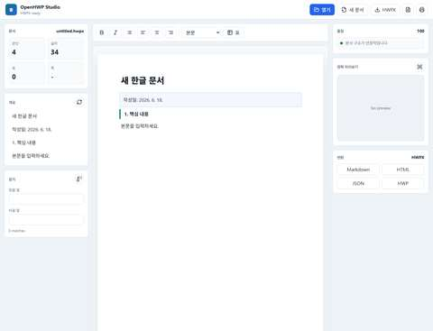

# OpenHWP Studio

[](https://github.com/kevin9327/openhwp-studio/actions/workflows/ci.yml)
[](https://github.com/kevin9327/openhwp-studio/actions/workflows/pages.yml)
[](LICENSE)

한컴 설치 없이 브라우저에서 HWPX/HWP 문서를 열고, 고치고, 점검하고, 변환하는 로컬 우선 문서 작업대입니다.

> Status: alpha. 지금은 HWPX 문단 편집과 구조 보존 저장에 집중합니다. HWP 바이너리는 `rhwp` 기반 미리보기/변환 흐름으로 다룹니다.

**Live demo:** https://kevin9327.github.io/openhwp-studio/

**Alpha release notes:** [v0.1.0-alpha.0](docs/releases/v0.1.0-alpha.0.md)

**Compatibility matrix:** [docs/COMPATIBILITY.md](docs/COMPATIBILITY.md)



## 한 줄 포지션

`rhwp`가 엔진이라면, OpenHWP Studio는 한국 문서 실무자가 바로 쓰는 HWPX 작업대입니다.

## 5초 안에 확인할 수 있는 것

- **샘플**: 정상 HWPX를 열고 문단/표 셀 텍스트를 편집합니다.
- **Media**: 다중 section HWPX와 `BinData` 미디어 참조를 검사합니다.
- **진단**: 깨진 manifest target과 누락된 `mimetype`을 보고, 안전한 자동 복구본을 다운로드합니다.
- **Report**: 저장/복구/호환성 결과를 JSON으로 남겨 “무엇이 보존됐는지” 확인합니다.

## 30초 데모

1. `.hwpx` 파일을 브라우저에 드롭합니다.
2. 문단을 바로 수정하고 문서 개요, 통계, 품질 점검을 확인합니다.
3. 원본 HWPX 패키지 구조를 유지한 채 저장하고, 라운드트립 검증 리포트까지 확인합니다.

처음 보는 사람은 라이브 데모에서 **샘플**, **Media**, **진단** 버튼으로 basic, media/BinData, broken-relationship HWPX fixture를 바로 열 수 있습니다.

이 프로젝트가 필요하다고 느꼈다면 star를 눌러 주세요. 한국 HWPX 문서 생태계에서 “로컬 우선, 검증 가능한 오픈소스 작업대”가 필요하다는 신호가 됩니다.

## 왜 필요한가

한국의 공공기관, 학교, 법원, 회사에는 아직도 HWP/HWPX 문서가 많습니다. 그런데 대부분의 오픈소스 도구는 세 가지 중 하나에 머뭅니다.

- 엔진은 강하지만 일반 사용자가 바로 쓰기 어렵다.
- 뷰어는 되지만 문서 수리, 검수, 변환 흐름이 약하다.
- 특정 에디터나 데스크톱 앱 안에 갇힌다.

OpenHWP Studio는 “또 하나의 뷰어”가 아니라 HWPX 문서를 실제 업무에서 고치고 검수하는 웹 작업대를 목표로 합니다.

## 바로 이기는 지점

- 설치 없는 웹 앱: 데스크톱 설치나 에디터 확장 없이 바로 실행
- 로컬 우선: 문서를 서버로 업로드하지 않는 방향
- HWPX 구조 보존: 가능한 한 기존 패키지 구조를 유지하며 편집 저장
- 검증 가능한 저장: 적용/스킵/불일치 항목을 Report JSON으로 남김
- 패키지 인스펙터: 섹션, 스타일, 관계, 미디어, 표/각주/머리말 위험도를 한 화면에서 확인
- 패키지 탐색기: ZIP entry, manifest target, media, doctor issue를 브라우저에서 바로 전환 확인
- 패키지 닥터: HWPX 필수 entry, XML 파싱, 미디어 참조, 미지원 컨트롤을 점수와 repair plan으로 표시
- 자동 복구 내보내기: 안전한 auto repair 항목은 원본 ZIP 구조를 보존한 repaired HWPX로 다운로드
- 복구 프리뷰: auto/manual/blocked/verify repair mode를 분리하고, 깨진 manifest target 샘플로 바로 검증
- 문서 검수 UX: 개요, 통계, 품질 규칙, 변환을 한 화면에 배치
- 엔진 친화: `@rhwp/core` 위에 사용자 경험과 워크플로를 얹는 구조

## 기능

- `.hwpx` 로컬 열기, `Contents/section*.xml` 분석, 문단 텍스트 편집
- 원본 HWPX 패키지 구조를 유지한 저장과 저장 후 문단 라운드트립 검증
- HWPX 패키지 인스펙터: 엔트리, 섹션, 스타일, 관계, 미디어, 표/각주/도형 감지
- HWPX 패키지 탐색기: entry 종류/크기, manifest target 존재 여부, media 참조 상태, doctor issue 목록
- HWPX 패키지 닥터: 구조 건강 점수, 위험 이슈, repair plan, Report JSON schema v2
- HWPX 자동 복구: missing `mimetype` 같은 안전한 메타데이터 수리를 repaired HWPX 다운로드로 검증
- 진단 샘플: `openhwp-broken-rel.hwpx`로 missing `mimetype`, missing manifest target, repair preview 흐름 확인
- 기존 HWPX 표를 편집 가능한 표로 표시하고 셀 문단 텍스트 라운드트립 검증
- 적용/스킵/검증 결과를 담은 Report JSON 내보내기. Report 버튼은 가능한 경우 최신 HWPX 검증을 먼저 실행합니다.
- 원본 대비 문단/표 셀 변경 추적과 Report JSON diff
- 표 구조를 유지하는 TXT/Markdown/HTML/JSON export
- `OpenHWPStudio` read-only export API와 공유 export 포맷터
- 공개 synthetic HWPX 샘플과 CI 회귀검사
- `@rhwp/core` WASM 기반 정확 미리보기, 페이지 이동, 확대/축소, HWP 변환 보조
- 편집 후 미저장 변경 표시와 닫기 전 경고
- 문서 개요, 문단/글자/표 통계
- 찾기/바꾸기, Markdown/HTML/TXT/JSON 내보내기
- 문서 품질 점검: 제목 누락, 긴 문단, 반복 표현 등
- 브라우저 인쇄/PDF 저장

## 참여하기 좋은 첫 작업

실제 GitHub Issues가 비어 있더라도 방향을 잃지 않도록 starter backlog를 문서화했습니다.

- [Community Backlog](docs/COMMUNITY_BACKLOG.md)
- [Compatibility report template](.github/ISSUE_TEMPLATE/compatibility_report.yml)
- [Roadmap](docs/ROADMAP.md)

가장 도움이 되는 기여는 공개 가능하거나 synthetic인 HWPX 샘플과, 그 샘플에서 기대되는 열기/편집/저장/복구 결과입니다.

## 포지셔닝

| 프로젝트 | 강점 | OpenHWP Studio가 노리는 자리 |
| --- | --- | --- |
| `rhwp` | Rust/WASM 기반 HWP/HWPX 핵심 엔진 | 엔진 위의 사용성, 검수, 변환 UX |
| `HOP` | 데스크톱 앱과 OS 통합 | 설치 없는 브라우저 작업대 |
| `kordoc` / `python-hwpx` | 패치, 검증, 자동화 | 브라우저에서 바로 보이는 적용/스킵/검증 리포트 |
| `unhwp` | Markdown/TXT/JSON 추출 | 사용자가 편집하고 다시 내보내는 작업 루프 |
| VS Code 확장 | 개발자/AI 에디터 통합 | 비개발자도 쓰는 문서 작업 화면 |

## 실행

정적 앱이라 `index.html`을 직접 열 수 있습니다. 정확 미리보기와 CDN WASM 로딩까지 안정적으로 쓰려면 로컬 서버를 권장합니다.

```powershell
npm start
```

Node가 PATH에 없다면:

```powershell
& "C:\Users\swsz9\.cache\codex-runtimes\codex-primary-runtime\dependencies\node\bin\node.exe" .\server.js
```

브라우저 주소:

```text
http://localhost:4180
```

## 개발

```powershell
npm run check
```

`check`는 JavaScript 문법, `app.js`가 참조하는 DOM id, `index.html` 정적 자산 계약, 공개 HWPX fixtures의 ZIP 구조/다중 section 문단 추출/media 감지/패치 라운드트립/패키지 닥터/탐색기/repair mode/auto repair 기대값을 확인합니다.

샘플 HWPX를 재생성하려면:

```powershell
npm run samples:generate
```

## 로드맵

- HWPX 표/이미지/각주 구조 편집과 리포트 기반 회귀 샘플
- HWP -> HWPX 변환 후 편집 가능한 워크플로
- 한컴/공공 문서 호환성 샘플 테스트셋 확장
- 문서 diff, 관계 그래프, 더 넓은 깨진 HWPX 자동 수리
- GitHub Pages 데모와 샘플 문서
- 브라우저 확장/파일 연결
- AI 문서 정리 플러그인: 민감정보 마스킹, 공문체 교정, 요약

## 한계

- HWPX 문단 텍스트 편집은 작동하지만, 모든 HWPX 컨트롤을 완전 편집하지는 않습니다.
- HWP 바이너리의 완전 편집은 아직 목표가 아니라 미리보기/변환 중심입니다.
- CDN으로 JSZip, lucide, `@rhwp/core`를 불러옵니다. 완전 오프라인 배포는 후속 작업입니다.

## 추천 GitHub Topics

`hwp`, `hwpx`, `hancom`, `hangul`, `korean`, `document-editor`, `document-conversion`, `rhwp`, `wasm`, `local-first`

## 프로젝트 문서

- [Compatibility Matrix](docs/COMPATIBILITY.md)
- [Benchmark Notes](docs/BENCHMARK.md)
- [Roadmap](docs/ROADMAP.md)
- [Korean Launch Note](docs/LAUNCH_KO.md)
- [Launch Plan](docs/LAUNCH_PLAN.md)

## 크레딧

문서 파싱/렌더링의 핵심은 MIT 라이선스의 [`@rhwp/core`](https://github.com/edwardkim/rhwp)를 사용합니다. OpenHWP Studio는 그 위에 로컬 문서 작업 UX를 얹는 프로젝트입니다.

## 라이선스

MIT
